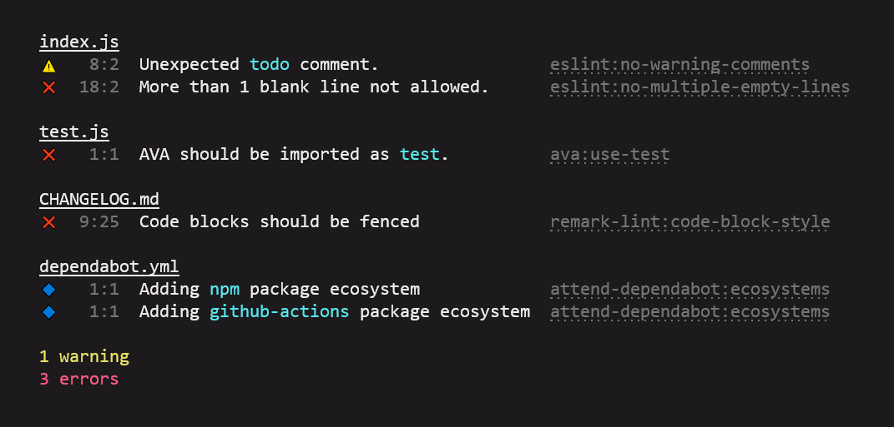

# vfile-reporter-shiny

**Shiny reporter for [`vfile`](https://github.com/vfile/vfile).** Visually similar to [`vfile-reporter-pretty`](https://github.com/vfile/vfile-reporter-pretty) but avoids a transformation to eslint messages which allows us to support info messages. In addition, it adds hyperlinks to [`remark`](https://remark.js.org/) and [`attend`](https://github.com/vweevers/attend) rules and enables unicode output and hyperlinks in Windows Terminal.

[](https://www.npmjs.org/package/vfile-reporter-shiny)
[](https://www.npmjs.org/package/vfile-reporter-shiny)
[](https://github.com/vweevers/vfile-reporter-shiny/actions/workflows/test.yml)
[](https://standardjs.com)
[](https://common-changelog.org)



## Highlights

- Sorts results by severity.
- Stylizes inline codeblocks in messages.
- In [terminals that support hyperlinks](https://gist.github.com/egmontkob/eb114294efbcd5adb1944c9f3cb5feda#supporting-apps):
  - Rules are linked to their docs. This works for [`eslint`](https://eslint.org/), [`remark`](https://remark.js.org/) and [`attend`](https://github.com/vweevers/attend) rules.
  - Literal urls in messages become links
  - Literal GitHub urls are displayed as e.g. `vweevers/vfile-reporter-shiny#1`
- In iTerm and ConEmu, click a filename to open it in your editor.

## Install

```
npm install vfile-reporter-shiny
```

## Usage

### [Attend](https://github.com/vweevers/attend)

Nothing to do. It's the default reporter.

### [Unified](https://unifiedjs.com/)

```
remark --report vfile-reporter-shiny .
```

### [Hallmark](https://github.com/vweevers/hallmark)

Nothing to do. It's the default reporter.

## License

[MIT](LICENSE). Forked from [`eslint-formatter-pretty`](https://github.com/sindresorhus/eslint-formatter-pretty).
